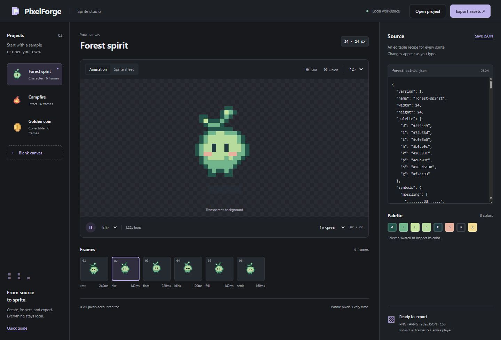
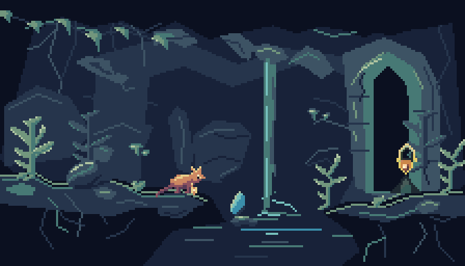
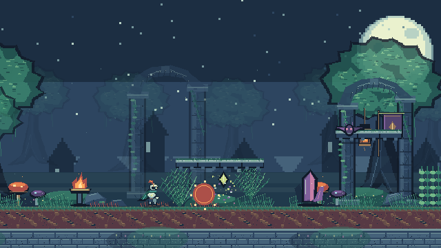
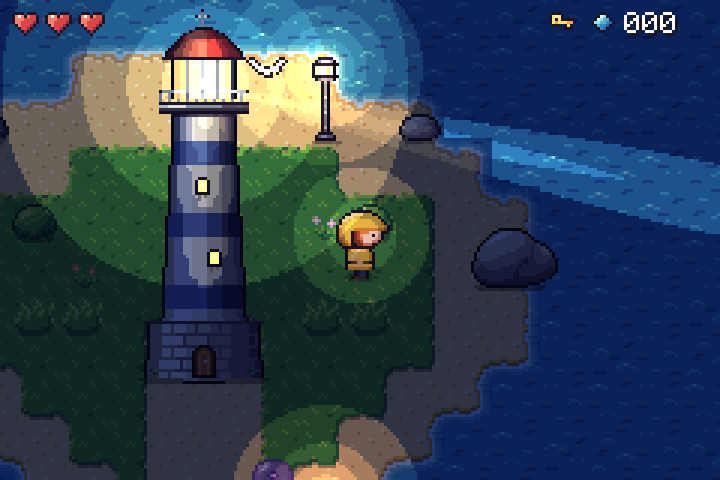

# PixelForge

[](https://github.com/skulitom/PixelForge/actions/workflows/test.yml)
[](LICENSE)
[](package.json)

**Text to pixels. A zero-dependency pixel art and sprite animation toolkit for AI agents and game developers.**

Write a JSON recipe with palettes, text grids, reusable symbols and drawing operations. Get transparent PNGs, sprite sheets, animated PNGs, GIFs for sharing, and the metadata and player needed to use them. Inspect and edit the recipe in a local browser studio.

Zero runtime dependencies. No build step, API key, image model, network service or native graphics library. Requires **Node.js 20 or newer**. Works from a checkout on Windows, macOS and Linux.



[Quick start](#start) · [Agent setup](#for-agents) · [MCP server](#connect-an-agent-through-mcp) · [Portable Windows build](#pixelforge-studio-a-portable-windows-build) · [Recipe reference](docs/agent-guide.md) · [Contributing](CONTRIBUTING.md)

## Art quality workflow

The [original Listening Hollow study](docs/art-quality-lab.md) demonstrates silhouette/value/native-size review, animation-aware onion skins, masked regional corrections, authored parts and attachments, guarded rebuild overlays, a small scene, PNG interchange and aligned normal/emissive passes. See the [format and workflow guide](docs/art-workflow.md) for the supported boundaries. This is a self-reviewed improvement study; it does not claim Animal Well parity.



```sh
npm run review:quality
node bin/pixelforge.js preview examples/quality/skink.json
node bin/pixelforge.js inspect examples/quality/skink.json --animation run --view onion --native --diagnostics
```

## Start

```sh
git clone https://github.com/skulitom/PixelForge.git
cd PixelForge
node bin/pixelforge.js preview
```

Open **http://127.0.0.1:4747**. Pick the forest spirit, campfire or coin; edit the JSON; inspect the animation or sprite sheet; download the asset ZIP. The studio includes playback speed, frame selection, integer zoom, a pixel grid, onion skinning, palette inspection, source save/open, a GIF download of the current animation, recovery of unsaved edits and live error messages. All assets and fonts are local.

Or generate an asset without opening a browser:

```sh
node bin/pixelforge.js init hero.pixel.json
node bin/pixelforge.js validate hero.pixel.json
node bin/pixelforge.js inspect hero.pixel.json --out hero-frames.png
node bin/pixelforge.js render hero.pixel.json --out output/hero
```

`inspect` saves a contact sheet of every frame and lists each frame's timing. Add `--grid` to read frames back as palette-key text; `--animation`, `--frames` and `--region` narrow the view. `patch hero.pixel.json --changes fix.json` previews targeted edits and reports every pixel they change; add `--out` to save the new recipe. `gif hero.pixel.json --out hero.gif` saves one animation as a GIF for sharing. Commands return JSON; errors go to stderr and exit with code 1. Use `-` instead of a filename to read JSON from stdin. Existing output files are protected; add `--force` to replace them. You can optionally run `npm link` for the `pixelforge` command. No `npm install` is needed.

## Play the local Emberfall demo

**Emberfall** is an original fantasy action platformer built to exercise PixelForge: 220 frames, 44 named animations, nine editable recipes, three elemental spells, reactive scenery, enemies and a boss. Its animation workshop exposes the recipes, contact sheets and complete export bundles.

```sh
npm run play
```

Open **http://127.0.0.1:4173** and choose **Begin adventure** or **Watch it play**. The game runs entirely in the browser with no runtime dependencies. It is currently a local preview; hosting is intentionally deferred.



[Demo details and controls](demo/README.md) · [Stress-test findings and bug reports](docs/bugreports/emberfall-stress-test.md) · [PixelForge art-quality roadmap](docs/reports/pixelforge-art-quality-roadmap.md)

## Tidewatch: a top-down showcase

**Tidewatch** is a second, independent demo: a small top-down adventure in which a lighthouse keeper relights the lamp before night falls. It exercises parts of PixelForge that Emberfall did not: 47-tile blob autotiles composed from quarter symbols, palette-cycled surf, a four-facing character compiled from pose parts with sword markers driving the hitbox, a pixel font, and night lighting composited from aligned normal/emissive passes. 29 recipes, 527 frames.

```sh
npm run play:tidewatch
```

Open **http://127.0.0.1:4180**.



[Showcase details](showcase/tidewatch/README.md) · [Findings report: bugs and missing features](docs/reports/tidewatch-showcase-report.md)

## For agents

Use PixelForge to create or revise pixel sprites, tiles, icons, effects and short animations from editable JSON. Choose the **CLI** when you have shell access or the **Model Context Protocol (MCP) server** when your client supports tools. Both use the same renderer and work locally.

| Entry point | Purpose |
| --- | --- |
| [llms.txt](llms.txt) | Compact documentation index with direct links for agents |
| [Pixel art skill](skills/pixel-art/SKILL.md) | Reusable authoring and visual inspection workflow |
| [Authoring guide](docs/agent-guide.md) | Recipe fields, drawing operations and limits |
| [JSON Schema](schema.json) | Machine-readable recipe structure |
| [Examples](examples/) | Complete forest spirit, campfire, coin and shrine recipes, a rotated sword swing and a particle effects source |
| [AGENTS.md](AGENTS.md) | Instructions for agents contributing to the toolkit |

Start with the authoring guide or MCP's `pixel_help`. Write a recipe, validate it, inspect every frame with `pixel_inspect` or `pixelforge inspect`, revise with targeted patches, then render to a fresh output directory. Validation checks the format; image inspection checks the art.

## A tiny animation

```json
{
  "version": 1,
  "name": "slime",
  "width": 8,
  "height": 8,
  "palette": { "g": "#72b58d", "e": "#20383f" },
  "frames": [
    {
      "name": "rest",
      "duration": 180,
      "ops": [{ "op": "grid", "x": 1, "y": 3,
        "rows": [".gggg.", "ggeegg", "gggggg", ".gggg."] }]
    },
    { "name": "up", "from": "rest", "translate": [0, -1], "duration": 180 }
  ],
  "animations": { "bounce": { "frames": ["rest", "up"] } }
}
```

Each text-grid character selects a palette color; `.` and space leave pixels untouched. Frame inheritance makes small changes cheap to describe. Rendering is deterministic and uses integer pixel coordinates.

## Export bundle

| File | Use |
| --- | --- |
| `name.png` | RGBA PNG sprite sheet, with configurable columns, padding and integer scale, or packed by visible bounds with `sheet.trim` |
| `name.atlas.json` | TexturePacker-style JSON hash: rectangles, trim offsets, source sizes, pivots/anchors, named points, frame durations and named animations |
| `frames/*.png` | Each frame as a transparent PNG |
| `animations/*.png` | APNG for each animation, retaining transparency, frame timing and loop behavior |
| `name.css` | CSS animation classes; supports multi-row sheets and unequal frame durations |
| `player.js` | Small, dependency-free Canvas player with play, pause, resume and named animations, plus `loadSpriteSheet`, `frameAt` and `drawFrame` for games |
| `name.pixel.json` | Editable source recipe |
| `preview.html` | Standalone preview you can open directly in a browser |

APNG files use the `.png` extension intentionally. Recipes can share a palette file (`"palette": { "$ref": "palette.json" }`), recolor keys per frame for palette cycling, copy rectangles from template symbols, outline layers (outside, inside or both, with direction masks for rim lights and drop shadows), dither between colours with canvas-anchored Bayer or custom patterns, and grow detail such as moss or cracks with seeded rewrite rules. They compile 47-tile blob or 16-tile cardinal autotile sets with `pixelforge autotile`; see the [authoring guide](docs/agent-guide.md) and [art workflow](docs/art-workflow.md#autotile-templates).

Several of these ideas come from [Pixel Composer](https://github.com/Ttanasart-pt/Pixel-Composer)'s node set, adapted to text recipes. Patches can propose De-Corner/De-Stray cleanup, and inspection diagnostics count per frame what it would change. Pose sources rotate parts by any angle into editable symbols, using RotSprite-style resampling that adds no colours, and tween eased in-betweens. Scene trajectories ease. A `pixelforge-fx` source compiles seeded particle emitters into an ordinary recipe with `pixelforge compile`. See [the shrine](examples/shrine.json), [the swing](examples/swing.poses.json) and [the effects](examples/effects.fx.json). Lossless non-interlaced 8-bit RGB/RGBA PNG import is supported, optionally with unscaled atlas timing metadata; see [interchange limits](docs/art-workflow.md#lossless-raster-return-path). GIF import, native Aseprite files and automatic quantization remain outside the current scope. Sources stay editable JSON.

### GIF for sharing

APNG keeps full alpha and exact timing, but many chat, forum and store pages only animate GIFs and cannot scale pixels crisply. `pixelforge gif` writes one animation as a GIF, enlarged by a whole number (by default the largest that keeps the longer side within 256 pixels):

```sh
node bin/pixelforge.js gif hero.pixel.json --out hero.gif
node bin/pixelforge.js gif hero.pixel.json --animation blink --scale 8 --background "#17191d" --out hero-blink.gif
```

Colours are exact: nothing is quantized or dithered, and a frame that needs more than 256 colours is refused with an error instead of being approximated. GIF has no partial transparency, so pixels below 50% alpha become transparent and the rest opaque; `--background` (a palette name or opaque hex colour) blends every pixel onto one colour instead, which keeps soft shadows. Frame times are rounded to GIF's 10 ms steps with the remainder carried to the next frame, and raised to 20 ms where shorter. The JSON result's `notes` say which of these happened. The studio's **GIF** button downloads the current animation at the current zoom, and MCP `pixel_render` takes `"gif": {}`. The export bundle itself is unchanged.

## Connect an agent through MCP

Clone the repository first, then add the server to your agent's MCP configuration. Replace `/absolute/path/to/PixelForge` with your checkout's absolute path; on Windows use forward slashes, for example `C:/DEV/PixelForge`:

```json
{
  "mcpServers": {
    "pixelforge": {
      "command": "node",
      "args": [
        "/absolute/path/to/PixelForge/bin/pixelforge.js",
        "mcp",
        "--out",
        "/absolute/path/to/PixelForge/output"
      ]
    }
  }
}
```

For clients that use TOML:

```toml
[mcp_servers.pixelforge]
command = "node"
args = ["/absolute/path/to/PixelForge/bin/pixelforge.js", "mcp", "--out", "/absolute/path/to/PixelForge/output"]
```

The eight tools are:

- **`pixel_help`**: authoring guide, full schema and a complete sample; `topic` returns the poses, scenes, autotile or fx schemas.
- **`pixel_validate`**: validate `{ "project": ... }` and save its recipe revision without exporting assets. Reports every clipped location.
- **`pixel_inspect`**: contact sheets, exact regional grids, silhouette/grayscale/onion views, 3×3 tile repeats with seam evidence, native size, named layer isolation, saved-reference comparisons and advisory diagnostics. Optional bounded samples expose omissions. Saves its recipe revision.
- **`pixel_patch`**: apply targeted `set`, `insert`, `remove` and `paint` edits. For example, `{ "paint": "frames[blink]", "value": [{ "x": 9, "y": 7, "color": "k" }] }` corrects a pixel in final canvas coordinates after all layers; `transparent` erases it. Returns every frame whose pixels changed (exact pixels for small edits) and a before/after PNG. The source stays unchanged and successful edits get a new revision.
- **`pixel_render`**: render `{ "project": ... }`, return a PNG contact sheet of every frame with cell names/timing plus the output folder, its key files and frame/animation counts (`listFiles: true` lists everything). Add `"animation": "idle"` to preview a sequence in playback order. The exported APNGs and HTML preview play the animation. Add `"gif": {}` (or `{ "scale": 8, "background": "#17191d" }`) to also write every animation as a GIF in `gifs/`, with notes on any alpha or timing change. Every call writes a fresh folder inside the configured output directory.
- **`pixel_compile`**: compile a `pixelforge-poses` source (including rotated parts and tweened in-betweens), a `pixelforge-autotile` template or a `pixelforge-fx` particle source into a recipe revision, with a contact sheet and optional metadata.
- **`pixel_scene`**: render a `pixelforge-scene` manifest (tilemaps with autotile legends, sequences, trajectories, lighting) at any time, or export it; assets may be revisions.
- **`pixel_import`**: import a native-resolution PNG, given as base64 or a file inside the server root, as a lossless recipe revision.

`pixel_patch` also supports compact `grid`, masked `move`, regional `recolor` and proposed `cleanup` of doubled corners and stray pixels, with explicit `frame` or `inherited` scope, and applies saved correction overlays (`overlay`). Large `pixel_render` previews are sampled with total/shown/omitted metadata instead of blocking a valid export; exported animations remain complete. Palette and scene file references resolve inside the server's `--root` (default: its working directory); requests may be up to 16 MiB, and an oversized request is answered with an error without stopping the server.

Send a recipe once. Each successful recipe-tool response includes a `revision` id that the other tools accept in place of `project`, so later calls, including patches, need not resend the recipe. Validate, inspect, patch and render save immutable snapshots in `<MCP --out directory>/.revisions/`; they survive restarts when you use the same directory, even before an asset export. Prefer an absolute `--out` path. Earlier revisions remain undo points. Older rendered revisions can be recovered from saved bundle recipes. Render also saves the recipe beside the assets.

The server implements newline-delimited stdio MCP with initialization, version negotiation, ping and tool discovery/calls. It supports protocol versions 2024-11-05, 2025-03-26, 2025-06-18 and 2025-11-25. It uses no HTTP transport or external services. See the [MCP stdio specification](https://modelcontextprotocol.io/specification/2025-11-25/basic/transports).

An agent can also use the CLI directly. The reusable [agent skill](skills/pixel-art/SKILL.md) and [authoring reference](docs/agent-guide.md) explain the complete format. [schema.json](schema.json) supports editor completion and structural validation; the rasterizer additionally validates references, matching row widths and resource limits.

## Use in a web app

Serve the exported folder with your application:

```html
<canvas id="sprite"></canvas>
<script type="module">
  import { SpritePlayer } from './assets/player.js';
  const player = await SpritePlayer.load(
    document.querySelector('#sprite'),
    './assets/forest-spirit.atlas.json',
    { scale: 4 }
  );
  player.play('idle');
  // player.pause(); player.resume(); player.destroy();
</script>
```

Or use CSS alone:

```html
<link rel="stylesheet" href="assets/forest-spirit.css">
<span class="pf-forest-spirit pf-forest-spirit-idle" role="img" aria-label="Forest spirit"></span>
```

CSS honors reduced-motion preferences. The Canvas API leaves autoplay decisions to the application. Atlas paths in `SpritePlayer.load` resolve relative to the atlas URL.

A game drawing many sprites into one canvas can use the same module's helpers. `drawFrame` places a frame by its anchor (when the recipe declares one) and restores trimmed frames to their original offset:

```html
<script type="module">
  import { loadSpriteSheet, frameAt, drawFrame } from './assets/player.js';
  const hero = await loadSpriteSheet('./assets/hero.atlas.json'), context = canvas.getContext('2d');
  requestAnimationFrame(function draw(time) {
    context.clearRect(0, 0, canvas.width, canvas.height);
    drawFrame(context, hero, frameAt(hero.atlas, 'walk', time), 64, 96, { scale: 3 }); // (64, 96) is where the anchor lands
    requestAnimationFrame(draw);
  });
</script>
```

For a game engine, use the atlas rectangles or individual PNGs. For regular-grid importers, set `sheet.padding` to `0` and use the exported frame dimensions. Phaser accepts the JSON-hash frame layout via `load.atlas`; named animation sequences are in the extra `animations` field. See [game integration notes](docs/game-integration.md).

## JavaScript API

```js
import { renderProject, inspectProject, patchRecipe, compareProjects, createBundle, writeBundle, compileEffects, animationGIF } from './src/index.js';

const project = renderProject(recipe); // RGBA buffers, durations, warnings
const view = inspectProject(project, { grid: true }); // contact sheet RGBA, palette-key grids
const { recipe: next, edits } = patchRecipe(recipe, [{ set: 'frames[idle].duration', value: 120 }]);
const report = compareProjects(project, renderProject(next)); // changed pixels, timing, before/after RGBA
const bundle = await createBundle(recipe);
await writeBundle(bundle, './output/my-sprite');
const { recipe: effects } = compileEffects(fxSource); // seeded particles baked into an ordinary recipe
const gif = animationGIF(project, 'idle', { scale: 8 }); // { data, width, height, notes, ... }
```

`src/core.js`, `src/craft.js`, `src/patch.js`, `src/fx.js` and `src/gif.js` are browser-compatible and have no Node imports. The Node-only exporter uses the standard library for compression and file output. The studio shares the same renderer as the CLI and MCP server.

## Develop and verify

```sh
npm test
npm run demo
```

Tests cover pixels, alpha blending, inheritance, transformations, flood fill, dither, outlines, rewrite rules, cleanup, rotation, tweens, particle effects, packing, timing, PNG/APNG structure, GIF structure and decoding, inspection sheets and grids, patching and comparison, revisions, overwrite protection, CLI stdin/errors, MCP calls, the Canvas runtime, the local server and the portable Windows build. Optional independent checks use Pillow and Python's ZIP reader: `python scripts/verify-exports.py` after `npm run demo`; it also decodes GIFs and compares every pixel, delay and loop flag.

The studio binds to `127.0.0.1`, serves an explicit asset allowlist, rejects foreign Host/Origin headers, and never writes through its HTTP API. Unsaved edits are kept as one draft in the browser's own storage for the studio's address and offered back on the next visit; nothing about them is sent to the server, and **Save JSON** remains the way to keep a recipe. Browser storage is per address, so a draft made on one port is not seen on another. Projects are limited to 256×256 pixels, 256 frames, 4,194,304 source pixels, 16,777,216 atlas pixels and bounded drawing/export work. This is designed for small sprites, effects and tiles.

## PixelForge Studio: a portable Windows build

`scripts/build-studio.mjs` packs the toolkit, the official Node.js 24 LTS runtime for 64-bit Windows and three small launcher scripts into one ZIP for people who have no Node.js, git or administrator rights. Unzipped, `PixelForge Studio.cmd` opens the studio in the default browser on loopback port 4748, or on any free port when that one is taken (the usual port is what lets the studio's draft recovery find its draft again), `pixelforge.cmd` is the command line, and `Connect your agent.cmd` prints MCP settings for Claude Code, Claude Desktop, Codex and Cursor with that folder's paths; it never edits a configuration file. Nothing is installed, and deleting the folder removes everything.

```sh
node scripts/build-studio.mjs           # dist/PixelForgeStudio-<version>-win-x64.zip, its .sha256 and a per-file manifest
node scripts/build-studio.mjs --check   # rebuild and compare with the ZIP in dist/
node scripts/verify-studio.mjs dist/PixelForgeStudio-<version>-win-x64.zip
```

The ZIP holds exactly the files `npm pack` ships (under `app/`), the runtime, and the contents of [packaging/windows](packaging/windows): no demos, tests or development scripts. The runtime is pinned in the build script by version and SHA-256, downloaded from nodejs.org on the first build (about 38 MB, cached in `dist/.cache`; `--node-zip <file>` uses a copy you already have) and included unmodified; a mismatch stops the build. `BUILD-INFO.txt` inside names the PixelForge version, the source commit and the runtime's hashes. A build refuses uncommitted changes to shipped files unless `--allow-dirty` marks it as a development build. One commit gives the same file list and per-file hashes anywhere; on 64-bit Windows the packing runs under the pinned runtime, so the ZIP itself is byte-identical.

`verify-studio.mjs` extracts the ZIP into a folder whose path has a space and a non-ASCII character and runs it with no Node.js or git on `PATH`: the launcher (two copies, loopback only, every studio route, foreign Host and Origin refused, export), the commands exactly as `START HERE.txt` gives them from Command Prompt and PowerShell, the MCP server over stdio, the helper's output, and that no process is left behind. The Tests workflow builds, rebuilds and verifies the ZIP on a fresh Windows runner, then runs the test suite on the bundled runtime. The portable build is Windows-only; on macOS and Linux use a checkout as described under [Start](#start).

## Contributing

Bug reports, recipe examples, documentation improvements and focused pull requests are welcome. Read [CONTRIBUTING.md](CONTRIBUTING.md) and [AGENTS.md](AGENTS.md) before changing the toolkit. Report reproducible bugs through [GitHub Issues](https://github.com/skulitom/PixelForge/issues).

## License

[MIT licensed](LICENSE). Included artwork is original and covered by the same license.
