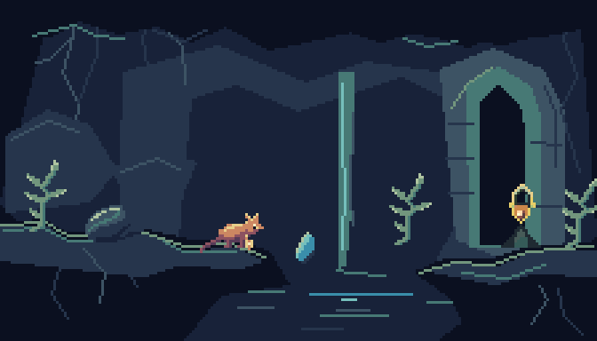
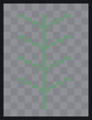
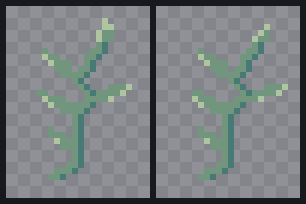
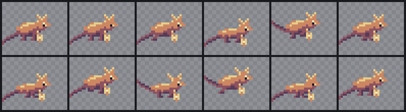
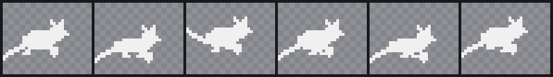
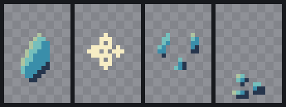
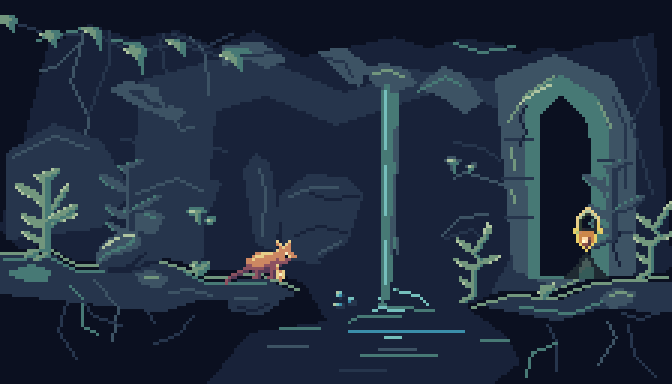
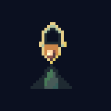
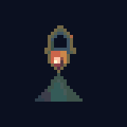

# The Listening Hollow: an original quality study

This small scene exercises the improved PixelForge workflow. Its goal is to make corrections reviewable, preserve intentional pixels and judge assets together. The result is **not claimed to match Animal Well**. It has not passed independent artistic review or the roadmap's equal-budget comparison across several attempts.


Open actual playback with:

```sh
node bin/pixelforge.js preview examples/quality/hollow.scene.json
```

Use the timeline to inspect anticipation, impact, separated crystal fragments and the persistent settled result. The scene restarts after four seconds. Toggle lighting, move the preview light and compare native size and grayscale. To review locomotion separately, open `examples/quality/skink.json` in the studio and choose **Run**; the scene's idle/cast demonstration alone does not validate stride mechanics. `examples/quality/stride.scene.json` adds an authored 32-pixel/second trajectory against repeating ground for that review.

## What the review changed

The first room rendered correctly but left large flat planes, a weak doorway and sparse scenery. Its vertical water and horizontal reflection suggested a material, but the surrounding forms were not developed enough.



The revision added branching leaf clusters, distinct foreground/distant foliage, structural mineral ledges, damaged masonry joints, short cave fungi and interrupted falling ribbons. The scene retains open space around the character and limits bright warm color to the focal subjects. These are authored contours and placements, not random texture. The result is more coherent than the first attempt, but several large rock masses still read as angular constructions, the doorway is too regular, and the environmental response is narrow. Those are remaining art problems, not parser bugs.

## Plant correction





The blockout was a straight stem with equal branches. The revision changes branch lengths, connects color clusters back to the stem and groups highlights near selected upper surfaces. A subsequent 3×3 tip correction is stored as a named canvas selection and fingerprinted overlay. Its source and inherited effects remain inspectable; the stem stays unchanged. To reproduce it:

```sh
node bin/pixelforge.js patch examples/quality/fern-base.json --changes examples/quality/fern-correction.json --out output/fern-reviewed.json --image output/fern-difference.png
```

The fern's two-pose sway remains modest. It teaches a structural correction; it is not a benchmark for sophisticated foliage motion. The broader sedge is a separate silhouette, not a larger fractional-scale copy.

## Poses and timing





The character uses authored parts and replacement shapes. Contact, compression and passing frames have different leg designs; compression replaces the body shape; the tail and crest change during casting. The pendant attaches to the body's grip in each pose. `skink.meta.json` records expanded sequence timing and marker coordinates. Increasing durations changes stride timing without requiring limb redraws.

There are twelve source frames. Idle and recovery intentionally reuse a resting image; frame uniqueness is not a quality target. The silhouette is readable, but foot contact and stride speed still need review against an actual movement trajectory. No automated detector is presented as certifying weight or absence of sliding.

## Material and aftermath





The reaction changes shape and timing: a 65 ms flash, 100 ms split, then settled fragments. A scene cue keeps the fallen state after the once-only sequence. Water uses elongated downward ribbons and pool ripples rather than the same geometry in another palette. The study does not yet demonstrate burned plants, freezing water, fluid displacement or broad interactive environmental behavior.

The lantern includes authored normal and emissive passes, with two light directions below. They share frame names, timing, animation order and atlas rectangles. Disabling lighting preserves the useful ordinary-color sprite.




## Reproduce and assess

The [brief](../examples/quality/brief.md) records intent and exemptions. Recipes, pose source, metadata, overlay and scene manifest are in [examples/quality](../examples/quality/). `node scripts/build-quality-lab.mjs --check` verifies tracked outputs without changing them. `--force` intentionally rebuilds the generated study. CLI writes refuse existing outputs by default.

Automated evidence covers export boundaries, exact edit scope, clipping, timing, source/atlas alignment, deterministic scene composition and lossless PNG import. `scripts/verify-quality.py` independently checks PNG/APNG pixels/timing and ZIPs with Pillow/Python, including all five PNG filters and the 65,535-entry ZIP boundary. `scripts/qa-quality-lab.mjs` checks actual browser controls and animation-aware onion behavior. These optional QA tools are not runtime dependencies.

For artistic acceptance, compare both images and actual playback at native size. Record reasons for preferring one, especially silhouette, connected color groups, material, weight and scene hierarchy. A useful next trial uses a held-out brief and equal authoring budgets, with randomized comparisons by the user or experienced pixel artists. This single study, its self-review and passing tests cannot establish that the toolkit reliably produces Animal Well-quality art.
