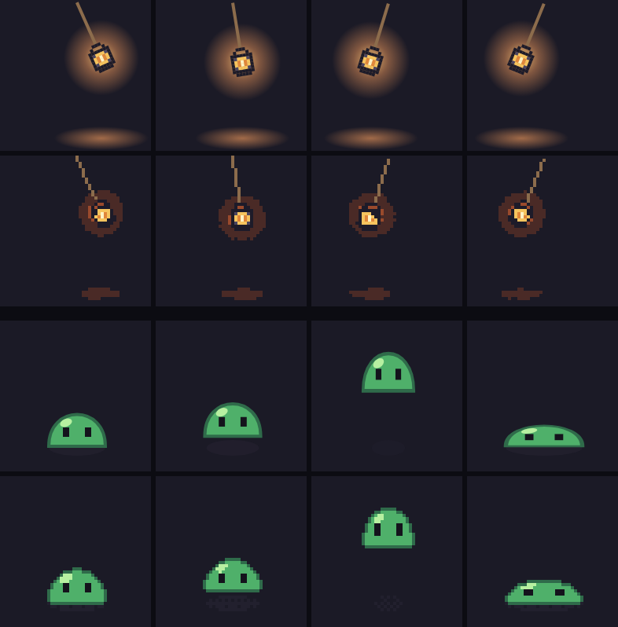

# Code-first animation: generalizing a converted draw loop

4 October 2026 · Baseline `d1dcb2a` (0.7.0) · Implemented in 0.8.0 as draw loops ([guide](../art-workflow.md#animations-written-as-code)).

## The prompt

A post by an indie developer ([@yurukusa_dev, 4 October 2026](https://x.com/yurukusa_dev/status/2106700171023425767)) reads, translated from Japanese: “I tried converting an effect written in code into a pixel-art rendering…! Dot-kun, from today you’re part of our family.” Its 5-second video shows a game’s effect twice: **CURRENT DRAW LOOP\*** (smooth Canvas drawing: a glowing meteor falls onto a target ellipse, bursts into a ring and fades) and **PIXEL PROTOTYPE** (the same effect in pixels). The caption under both reads “Same fall 0.50s / radius 40 / aftermath 0.80s”, and the footnote “\*Source-extracted + glow adapter. Offline JS Canvas render, not game capture.”

We do not have its source. Measured from the video (frames extracted with ffmpeg, not judged by eye):

| Observation | Evidence |
| --- | --- |
| Uniform square pixels of roughly 9 screen pixels each in the recording. | Full-resolution crops of the falling meteor. |
| A short fire ramp: cream, pale orange, orange, red and deep red, plus a dark maroon for the aftermath. | Histogram of the pixel panel’s non-background colours over 51 sampled frames. Exact values are uncertain because of video compression. |
| The same timing as the smooth version, at the same update rate: no held poses. | In the 60 fps recording, both panels change on the same frames, about 30 times a second. |
| Fades become broken, darker rings instead of transparency. | The aftermath turns into deep-red dashes that disappear piece by piece. |
| The aiming ellipse was not converted. | It is anti-aliased in the pixel panel too. |

## The method, generalized

The post shows one effect, but the method has three parts that apply to any animation written as code:

1. **Animation as code.** A draw function of continuous time and coordinates, written the way game code draws. The game’s numbers (fall time, radius, aftermath) stay the source of truth, so the sprite cannot drift from the hitbox or the sound.
2. **Sampling.** When to look at the function is a separate decision: fewer, held frames than the game’s 60 Hz loop, with the game’s moments landing on frame boundaries.
3. **A pixel-art renderer for the drawing calls.** Each drawing call keeps its meaning, and everything smooth gets a pixel-art translation: no anti-aliasing, palette colours, glows and fades as bands and cooling, thin lines without doubled corners.

PixelForge now implements exactly that, without anything specific to an effect: a **draw loop** is a `.mjs` module whose `draw(ctx, t)` is ordinary Canvas 2D code. `src/drawloop.js` runs it against a pixel-art context at every frame of a millisecond timeline and writes an ordinary recipe. The same function still draws smoothly into a browser canvas. The [art workflow](../art-workflow.md#animations-written-as-code) documents the context; the rules below are why it behaves as it does.

Code suits motion, timing and light. It does not design forms: PixelForge’s own Emberfall review found that generator-made forms looked assembled from basic shapes ([art-quality roadmap](pixelforge-art-quality-roadmap.md)). The examples therefore draw forms as authored sprites (`drawImage`) or keep them simple, and give code the motion.

## Evidence

*[examples/lantern.loop.mjs](../../examples/lantern.loop.mjs) and [examples/slime.loop.mjs](../../examples/slime.loop.mjs), unchanged, drawn by headless Chromium’s Canvas 2D (above) and by PixelForge (below) at the same moments. The browser harness drew `drawImage` palette rows and ignored `ctx.point`, which a browser context lacks; it is not part of the toolkit.*

- **Different kinds of motion through one context.** The lantern combines an authored sprite turned by RotSprite, a one-pixel rope, an additive radial glow on a light ramp and a floor pool made elliptical by `scale()`. The slime combines squash and stretch through `scale()`, an eased jump, a one-pixel outline, a translucent shadow that dithers, a landing cue and a `feet` point per frame.
- **The original case needs nothing special.** The post’s meteor, rewritten as plain canvas code (an `ellipse` target, a gradient streak, `shadowBlur`, an additive flash and spreading ring, a translucent scorch ring), compiled through the same context with `units: 0.5` for its game-sized coordinates. That check stayed in a scratch folder; no meteor ships.
- **Tests.** `test/drawloop.test.js` covers pixel-centre fills, mirror-symmetric one-pixel circles without doubled corners, wide strokes, transforms, colour mapping and the report of unmapped colours, dithered and thresholded coverage, ramp banding, cooling and additive light, banded shadow glows, clip and layers, text, sprites through scaling, mirroring and turning, errors for unsupported calls, timeline sampling with cues and points, the examples, and the CLI.
- **Corrections survive rebuilds.** A two-pixel overlay on the slime’s landing frame, applied through the CLI directly to the `.mjs` loop: reapplied after an unchanged rebuild; applied and reported `rebased: true` after a deeper crouch changed only earlier frames; refused with a fingerprint conflict naming `slime-7` after moving the ground by one pixel.

## Conversion rules

These came from the first, effect-specific prototype (below), where each wrong-looking result taught one rule. The context applies them to every drawing call.

| Smooth feature | Pixel translation | What went wrong without it |
| --- | --- | --- |
| Glow and bloom | Keys on a ramp act as light: coverage scales a key’s level, `lighter` adds, and the result bands along the ramp above a floor. | Too much light in the top band rendered a white blob; with no floor, a blur’s faint tail flooded the canvas with the coolest key. |
| Alpha fade | On a ramp, a fading key cools down it and vanishes; a solid key dithers by coverage. | A translucent key has no pixel meaning. |
| Thin anti-aliased strokes | One pixel wide, lit where the path crosses each pixel’s inscribed diamond, with inside-of-L pixels removed regardless of direction. | Sampling a field broke the target ellipse into dashes; tracing in drawing order made mirrored sides of a circle differ. |
| Perfect geometry | Optional seeded breakup of ramp bands into clusters, reseeded per frame for flicker. | Rings and discs looked machine-perfect. |
| Ordered dither | For solid keys’ partial coverage; off by default for ramp bands. | A Bayer-thinned scorch became an evenly spaced dot grid. |
| 60 Hz draw loop | Sampling on a millisecond timeline at a chosen rate, every cue starting a frame. | The post keeps the source’s update rate; held frames are the usual pixel-art choice, and durations keep the total exact. |
| CSS colours | Palette keys: exact palette matches, or an explicit `colors` map; unmapped colours are reported. | Guessing would quantize, which PixelForge leaves to the author. |

## How this changed from the first pass

The first response reproduced the post’s effect rather than its method: a meteor generator with its own heat-field renderer, `rampRows` for heat, a `timeline` with cues for particle effects and a `strike` example that copied the post’s impact (commits `5e8cf67` and `9be6183` on this branch). The meteor prototype, its image and the `strike` example are gone. What generalizes stayed: `rampRows` is the ramp step of the context and remains usable on its own; `frameStarts` and the millisecond `timeline` with cues are shared by draw loops and particle effects.

## Limits

- **A subset of Canvas 2D.** Patterns, filters, dashed lines, conic gradients, `arcTo`, `Path2D`, `strokeText` and pixel reads are errors naming the call; line caps and joins are approximated as round. Draw code that uses them needs rewriting first.
- **Code runs locally.** Draw loops execute through the CLI or `compileLoop`; the MCP server does not run code.
- **Determinism depends on the loop.** The context is deterministic; draw code that uses `Math.sin` or `Math.random` may differ in its last bits between engines. `drawImage` rotation rounds to whole degrees.
- **Art quality is self-reviewed.** Both examples were tuned by eye in a few passes (the lantern’s floor took three tries) and have had no independent review. Nothing here shows code-first animation looking better than hand animation; it shows that code-defined motion becomes an editable, correctly timed recipe, and which translations matter.
- **The post’s code is unavailable,** so its adapter is inferred from a compressed screen recording.
