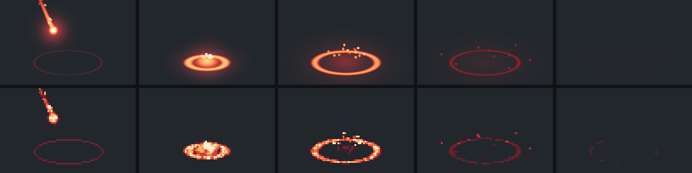

# Code-first effects: what a converted draw loop teaches PixelForge

4 October 2026 · Baseline `d1dcb2a` (0.7.0) · Investigation and prototype only; no toolkit behaviour changed.

## The prompt

A post by an indie developer ([@yurukusa_dev, 4 October 2026](https://x.com/yurukusa_dev/status/2106700171023425767)) reads, translated from Japanese: “I tried converting an effect written in code into a pixel-art rendering…! Dot-kun, from today you’re part of our family.” Its 5-second video shows two panels side by side:

- **CURRENT DRAW LOOP\***: the game’s effect as smooth Canvas drawing. A glowing meteor falls onto a target ellipse, bursts into a bright ring and fades.
- **PIXEL PROTOTYPE**: the same effect in pixels. The caption under both reads “Same fall 0.50s / radius 40 / aftermath 0.80s”, and the footnote “\*Source-extracted + glow adapter. Offline JS Canvas render, not game capture.”

We do not have its source. From the video itself (frames extracted with ffmpeg and measured, not judged by eye):

| Observation | Evidence |
| --- | --- |
| Uniform square pixels of roughly 9 screen pixels each in the recording. | Full-resolution crops of the falling meteor. |
| A short fire ramp: cream, pale orange, orange, red and deep red, plus a dark maroon for the aftermath. | Histogram of the pixel panel’s non-background colours over 51 sampled frames. Exact values are uncertain because of video compression. |
| The same timing as the smooth version, at the same update rate: no held poses. | In the 60 fps recording, both panels change on the same frames, about 30 times a second. |
| Fades become broken, darker rings instead of transparency. | The aftermath turns into deep-red dashes that disappear piece by piece. |
| The aiming ellipse was not converted. | It is anti-aliased in the pixel panel too. |

Our reading, which is an inference: the motion and timing were extracted from the game’s own effect code, and an adapter translated the smooth parts (glow, alpha, thin anti-aliased lines) into pixel-art equivalents. The gameplay numbers stay the source of truth.

## Verdict

**Yes, for effects and for the timing of motion; no, as a way to draw forms.**

Effects are mostly energy, falloff and timing, which code states precisely. Keeping the game’s numbers authoritative means the sprite cannot drift from the hitbox, sound cue or screen shake: change the radius in code and regenerate. Variants become parameters rather than redraws.

Characters, props and environments are different. PixelForge’s own Emberfall review found that generator-made forms looked assembled from basic shapes and that animation mostly moved existing pieces ([art-quality roadmap](pixelforge-art-quality-roadmap.md)). Code-first does not fix that, and the roadmap’s silhouette-first workflow still applies. The useful split is **code for energy and timing, authored symbols and poses for form**, which is already how `pixelforge-fx` divides the work.

PixelForge is well placed to do this better than an offline Canvas render, because the converted result can be an ordinary recipe: inspectable, patchable, and with hand corrections that survive regeneration or refuse to apply when the code changed underneath them. The prototype below confirms each of those.

## Prototype

[`scripts/prototype-code-first-fx.mjs`](../../scripts/prototype-code-first-fx.mjs) recreates the post’s experiment inside PixelForge. A meteor strike is written as a game would write it: a function of time in seconds that returns float primitives (a glow, a tapered streak, a disc, a ring, a scorch mark, seeded embers and sparks) using the post’s numbers: 0.5 s fall, radius 40 game pixels, 0.8 s aftermath. Two renderers read that one function:

1. A smooth reference: anti-aliased colour gradient, additive bloom and alpha fades, standing in for the Canvas draw loop.
2. A pixel adapter that samples heat at native resolution (112×72), maps it onto an authored palette ramp, and writes a version-1 recipe.

```sh
node scripts/prototype-code-first-fx.mjs --out output/code-first-fx [--radius 40]
node bin/pixelforge.js inspect output/code-first-fx/meteor.recipe.json --animation strike --diagnostics
```

It writes `meteor.recipe.json`, `compare.apng` (smooth left, pixel right, 30 fps, looping) and the strip below. It refuses an existing folder unless `--force` is given. It runs in about 12 seconds, nearly all of it in the smooth reference.



*Smooth reference above, pixel adapter below, at 417, 550, 667, 917 and 1167 ms. Both rows are sampled on pixel-pose boundaries.*

### Result

- **17 poses instead of 78 draw-loop frames** (1.3 s at 60 Hz). Durations are 83–84 ms (about 12 poses a second), with two 50 ms poses at contact for punch. Pose boundaries sit on the game’s own times, so the contact pose starts at exactly 500 ms and the last ends at 1300 ms. The contact pose carries an `impact` point, and every pose anchors on the impact centre.
- **8 palette keys**: a five-step fire ramp, two scorch tones and a marker colour. Each frame has named `marker`, `scorch` and `fire` layers.
- **An ordinary recipe of 22.8 KB** (formatted). It validates without warnings and inspects, patches, renders and exports with the existing CLI.

### Conversion rules the prototype established

The first pass looked wrong in specific ways; each fix became a rule. These are the substance of a “glow adapter”.

| Smooth feature | Pixel translation | What happened without it |
| --- | --- | --- |
| Glow and bloom (alpha falloff) | Heat mapped onto a short palette ramp, transparent below a floor (0.2 of full heat). White only at the very hottest. | Too much heat in the top band: the contact pool rendered as a white blob. |
| Alpha fade | Cool down the ramp (white → orange → red → deep red), then erode whole clusters. | Not attempted; this is how the post’s aftermath reads too. |
| Perfect geometry | Seeded breakup in 2-pixel clusters, multiplying heat by 0.45–1.55. Fire reshuffles its clusters every pose; ground marks keep one seed so the same pieces vanish first. | Rings and discs looked machine-perfect. |
| Thin anti-aliased strokes | The renderer’s own pixel-perfect `ellipse` (or `line`) operation, not a sampled field. | The field-sampled aiming ellipse broke into dashes with doubled corners. |
| Ordered dither | Off for fire and for fading marks. | A scorch thinned by a Bayer threshold became an evenly spaced dot grid. Bayer 4 at the flame’s band edges added scattered single pixels without smoothing the ramp. That difference is small on enlarged sheets. |
| 60 Hz draw loop | About 12 poses a second, with boundaries on the game’s cue times. | The post keeps the source’s update rate; fewer, held poses are the usual pixel-art choice, and recipe durations let the total stay exact. |

Three tuning passes were needed, judged by eye on contact sheets at native and enlarged size. This is a self-review, not independent evidence of quality.

### The inspection and correction loop works on generated art

`inspect --diagnostics` on the generated recipe reported:

- **A duplicate.** Poses 0 and 1 are identical because the game’s ease-in keeps the meteor off-canvas for the first 167 ms. That is a real authoring question the smooth version hides (do those poses earn their time?).
- **Isolated pixels** on poses 9–15. These are the sparks, and they are intended.
- **An empty final pose.** The effect’s lifetime ends with nothing visible.

A hand correction made with `pixelforge overlay` (four painted pixels brightening the contact pose) was then reapplied to regenerated recipes:

| Regeneration | Outcome |
| --- | --- |
| Same code | Applied. |
| Spark heat changed (poses 7–13 differ, the corrected pose does not) | Applied, reported `rebased: true`. |
| `--radius 46` (the corrected pose differs) | Fingerprint conflict naming `strike-6`; nothing applied. |

This is the main advantage over the post’s offline render: the code is the source of truth for motion, the artist still owns the last pixels, and a rebuild never silently misplaces a correction.

## What PixelForge has, and what this effect needed

PixelForge already has seeded hashing and polynomial trigonometry (`craft.js`), easing presets, ordered dither, a particle compiler that bakes seeded emitters into ordinary recipes (`fx.js`), per-pose millisecond durations, anchors and named points exported to the atlas, layers, pixel-perfect primitives, advisory diagnostics and fingerprinted overlays. The prototype relied on the hashing, trigonometry, durations, anchors and points, layers, the `ellipse` primitive, diagnostics and overlays. It defined its own two easing curves and left dither off. Reading `fx.js`, the effect could not be expressed as a `pixelforge-fx` source today:

- **No shapes that change over time.** Emitters stamp fixed symbols. An expanding, thinning, cooling ring would need a hand-drawn symbol for every size.
- **No heat-to-ramp mapping.** Particles carry no intensity; the nearest tools are one-colour `dither` density ramps and `remap`.
- **Emitters cannot move.** `at` is fixed, so embers cannot be shed along the meteor’s path. A `trail` is a one-colour line back to where the particle was at most 16 frames earlier.
- **Timing is counted in frames.** An effect is `frames` × `duration`. Placing contact at exactly 500 ms is the author’s arithmetic, and nothing exports it as a cue.
- **Dissolve is ordered-dither thinning only.** On fire that reads as the checkerboard the prototype rejected.

## Recommendations

In order. Effort is relative: small is a focused addition, medium spans compiler, schema, docs and tests.

1. **A heat-ramp rasterizer in `craft.js`** (small). Something like `rampRows(width, height, sample, { ramp, floor, breakup, cluster, seed })` returning palette rows. It would be deterministic, browser-compatible, and use only the author’s palette keys. It is the reusable core of the adapter. Exporting it serves agents writing their own generator scripts, the code-first path the competitive review already prefers to an expression language.
2. **Shapes in `pixelforge-fx`** (medium). `glow`, `ring`, `streak` and `disc` elements beside emitters, with values keyed over time and eased (radius, thickness, heat), rendered through a `ramp`. Also emitters that follow a `path` or another element, and a clustered `dissolve` mode. The output stays an ordinary recipe, as now.
3. **Millisecond timelines with cues** (small to medium). An effect would declare its length, a pose rate or explicit boundaries, and `cues` such as `{ "impact": 500 }` that are guaranteed to start a pose and are exported as points or metadata. This is the “same timing as the game” contract.
4. **A worked example and guidance** (small). Add the meteor to `examples/` once 1–3 exist, and a section in [the art workflow](../art-workflow.md) with the conversion table above and the boundary: code for energy and timing, authored symbols and poses for form, then inspect and correct with overlays.

Not recommended:

- **Pixelating arbitrary Canvas renders or screenshots.** Quantizing float colours would pick palette entries for the author, which PixelForge deliberately leaves out of scope. Mapping a heat field onto a ramp the author chose is a different operation: every output colour is authored.
- **An expression language inside JSON.** The [competitive review](../competitive-review.md) already concluded that the agent is the scripting layer. Generator scripts plus declarative compilers cover both ends.
- **Code-first characters and environments**, for the reasons in the roadmap.

## Limits

One effect, tuned and reviewed by the same agent that built it, with no independent art review. The post’s code is unavailable, so its adapter is inferred from a compressed screen recording, and the smooth reference here is an approximation of a Canvas draw loop rather than that game’s code. The prototype uses floating-point square roots for its own fields; a toolkit version must keep `craft.js`’s determinism rules and add tests. Nothing here shows that code-first effects look better than hand-animated ones; it shows that a code-defined effect can become an editable, correctly timed PixelForge recipe, and which translation rules mattered.
