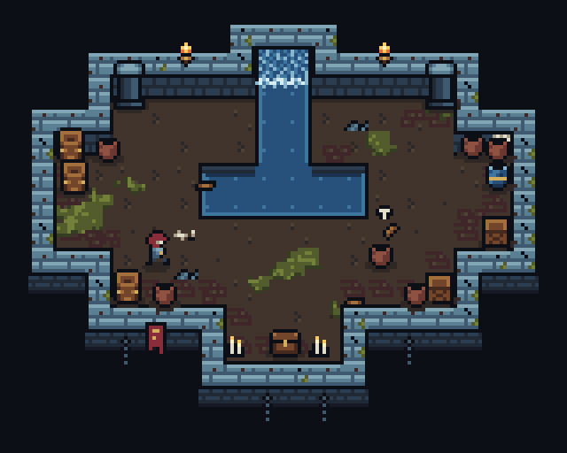

# Can PixelForge make 3/4 dungeon dioramas?

7 October 2026 · Toolkit `1285180` (0.7.1) · Linux, Node v22.22.0 · Study: [`showcase/diorama/`](../../showcase/diorama/README.md)

The question was whether PixelForge can produce pixel art at the level of four short reference clips (procedurally generated top-down dungeon rooms, shared as a Twitter GIF download), and what would have to change. To answer from evidence rather than from the feature list, I decoded the clips, measured them, and then built an original room in the same style with the toolkit exactly as it is. Everything below is either a measurement or something that happened during that build.


[Animated version (GIF, 3×, made with `sequence` and `gif-frames`)](../images/diorama/room.gif): the hero walks in, strikes, a pot breaks into shards that stay on the floor, the chest opens; water sparkles, the waterfall flows, torches flicker.

## Answer

**Yes for the assets, not yet for the finish, and the composition step needs work.**

- Everything in the reference fits inside PixelForge's limits and can be expressed exactly. The rooms are 120 to 216 pixels wide (the canvas and scene limit is 256), the tiles are 8 pixels and the palettes hold about 20 to 30 colours.
- With no toolkit changes, one 304-line generator script produced a room built the same way as the reference: 3/4 walls with caps and front faces, sunken autotiled water, a waterfall, props, torches, moss, cliffs and chains, a 7×10 hero who walks and strikes, a pot that breaks into lasting shards, and a palette theme swap. It renders at 31 colours, and the GIF decodes back to the source frames exactly.
- The study is not as finished as the reference: fewer and plainer props, flatter floors, a less readable hero. That gap is authoring time and craft, which PixelForge does not supply. Nothing the reference does is out of PixelForge's reach.
- What *was* missing is composition support. The script did work that the toolkit should do: choosing tiles from what lies next to a cell, giving autotiles shape variants, shading without inventing colours, running craft operations over a composed room, and coordinating actors in a scene. The seven changes below are ordered by how much of that script they would delete. None of them needs a larger canvas or new shape primitives.

## The reference, measured

The clips are H.264 videos, 960 to 1280 pixels wide, of pixel art enlarged by whole or near-whole factors. I recovered the native images by sampling the centre of each art pixel and grouping colours that compression had smeared. The frames are third-party art and are not included in this repository; only the measurements are.

| Clip | Native size | Enlargement | Contents |
| --- | --- | --- | --- |
| 1 | 192×144 | 6.67× | Grey stone room; the hero walks around, opens a chest and slashes barrels and pots, which break into planks and shards that stay on the floor |
| 2 | 120×120 | 9× | Stone shrine with a red carpet and two water basins joined by waterfalls; animated water |
| 3 | about 107×89 | 9× | Red-rock cave with grass and autumn trees; dithered shadow at the exit |
| 4 | 216×172 | 5× | Three blue-stone rooms with brown floors, a water channel with pillars, moss, cobwebs, bones and wall torches |

Style rules that every clip follows:

- **Grid and palette.** 8-pixel tiles. Roughly 20 to 30 colours per room (compression blurs the exact count). The void is a near-black navy, and the same colour serves as the outline.
- **Perspective.** 3/4 view. Every wall has a light cap with brick seams, about 8 pixels deep. Walls with floor to the south also show a front face of about 5 pixels and a 1-pixel contact line. The room floats in the void: the outer faces of its south edge and chains hang below it, and banners hang over that edge.
- **Water.** Pools sit below the floor, with their own north wall visible, a dark reflection band under that wall and a lit rim elsewhere. Waterfalls join pools at different heights.
- **Dressing.** Brick patches and moss blobs cross tile edges. Cobwebs sit in corners. Props are 6 to 10 pixels with dark outlines and contact shadows, and line the walls. Room shapes are unions of rectangles, so they are generated.
- **Motion.** A hero of about 7×10 pixels with a walk cycle and a short white slash smear. Breakable pots, an opening chest, flickering torches, flowing water.
- **Themes.** Grey stone, blue stone on brown floor, and red rock with grass. They differ in palette and props, not in construction.

## The study

[`showcase/diorama/build.mjs`](../../showcase/diorama/build.mjs) writes ordinary PixelForge sources into `showcase/diorama/art/`. The art is original: my own palette, tiles and sprites, built the same way as the reference rather than copied from it. Side by side at the same scale with the decoded clip 4 (not reproduced here), the construction matches, while the reference's floor texture, prop density and prop variety stay ahead.

| Reference element | How the study made it | Friction |
| --- | --- | --- |
| Wall caps | 47-tile blob autotile from a 16×24 template, placed with a scene `tilemap` legend `autotile: "blob"` | A shape variant (cracked, mossy caps) needed a second compile merged into the same recipe by script ([F2](#f2-autotile-variants-are-palette-only)) |
| North faces, cliffs below the island | Plain 8 px tiles in their own tilemaps | Which cell gets one depends on its neighbours, so the script computed a character map for each ([F1](#f1-a-tilemap-sees-only-same-or-different)) |
| Sunken water | Blob autotile with four palette-cycled variants, 188 frames, one animation per mask | None: it worked as written |
| Waterfall | `translate` with `wrap`, four frames per half | Two halves picked by script so neighbouring columns join without a seam (F1) |
| Brick patches, planks | Free-placed decal frames | Placed by hand coordinates |
| Moss | A map-sized decal: the floor painted as a marker colour, radial `noise` dithers over it, `rewrite` rules as cellular clean-up, the marker erased | The renderer cannot see the scene's floor, so the script painted it ([F4](#f4-nothing-runs-over-the-composed-room)). White noise needed hand-tuned rules to clump ([F5](#f5-noise-has-no-clumps)) |
| Drop shadows | An opaque floor-shadow ellipse in each prop | Wrong colour on moss and bricks; no way to darken what is underneath ([F3](#f3-shading-invents-colours-or-ignores-the-surface)) |
| Props, torch, foam | Palette grids; four authored flames; three authored foam frames | None |
| Hero | 13 frames on a 12×14 canvas: idle, walk down, walk right and a three-pose attack | None at this size; the pose compiler is unnecessary for 7×10 sprites |
| Slash smear | A computed crescent, thinned and dissolved with `dither erase` | Must stay hidden until its cue, so it carries an empty frame ([F6](#f6-scene-actors-cannot-relate)) |
| Pot breaking | `pot-break` animation that holds its shards; a seeded `pixelforge-fx` burst with floor and bounce | Four instances synchronised by hand-typed times; the fx output needed an extra empty frame (F6) |
| Themes | The same keys with other colours: eight changed colours turn grey stone into blue stone on a brown floor | The whole asset folder is copied per theme ([F7](#f7-a-scene-cannot-re-theme-its-assets)) |
| Shareable animation | `sequence --fps 20 --scale 3`, then `gif-frames` | None: 48 frames, 31 colours, every frame pixel-identical when decoded with Pillow |



The scene has 49 placements: six tilemaps covering 212 tile cells, one decal and 42 props, actors and effects. That is well inside the 4,096-draw limit.

## What worked without changes

- **Exactness.** Renders, sequences and the GIF keep exactly the 31 palette colours. Nothing is quantized or smoothed, and a 3× enlargement stays crisp.
- **Autotiling and animation.** The blob autotile compiler, tilemaps with position-picked variants and context cells, palette-cycled autotile variants, `translate` with `wrap`, nonlooping animations that hold their last pose, and scene `sequence` cues and `trajectory` paths covered every animated element: water, waterfall, torches, walk, strike, pot break, shards and chest.
- **Craft operations.** `dither` with `noise` and `over`, `rewrite` and `replace` were enough to grow clumped moss inside an exact mask.
- **Particles.** `pixelforge-fx` produced believable debris on the first try: seven shards with gravity, a floor line and a bounce.
- **Sharing.** The `sequence` and `gif-frames` pipeline needed no other tools.

## What got in the way

### F1. A tilemap sees only "same or different"

A legend entry's mask records which neighbours share its character. A 3/4 room needs to know *what* lies next to a cell:

- a wall with floor below it casts a face into that floor;
- an island cell with void below it hangs a cliff into the void;
- a waterfall column needs to know whether another column lies to its west;
- brick patches belong next to walls.

`match` widens "same" but cannot tell floor from void, and the reduced blob mask drops a diagonal unless both of its sides match. The script therefore computed four context-dependent character maps (faces, cliffs, waterfall halves, wall-side bricks), each drawn as its own tilemap layer. This is the largest single cost of the study, and it is also what a level generator would have to repeat for every room.

### F2. Autotile variants are palette-only

`variants` in an autotile source recolour the set. A different stone pattern, such as cracks or moss on some caps, is a different template. The script compiled a second set and merged both into one recipe, renaming the template symbol, because a tilemap legend can only pick variants from one asset's frames. Legend variants are also unweighted: the study repeated `floor-0` in the list to make it common.

### F3. Shading invents colours or ignores the surface

The reference shades by moving a colour down its own ramp: a shadow on grey floor is the darker grey, and on moss it is the darker green. PixelForge has no notion of ramps. Scene `lighting` multiplies RGB, which leaves the palette, and a semi-transparent shadow blends into new colours. The study's drop shadows are opaque floor-shadow ellipses baked into each prop, so they are the wrong colour wherever a prop stands on moss or bricks. Wall ambient occlusion, torch light pools and the blue theme's shadows have the same problem.

### F4. Nothing runs over the composed room

`dither`, `rewrite`, `outline` and `fill` work on one recipe's buffer. A scene only stacks finished frames, so nothing can run over the room as composed: no moss creeping onto the floor wherever floor is, no cobwebs wherever an inner corner forms, no outline around a cluster of props. The moss decal works only because the script painted the floor again as a marker colour. Any change to the map means regenerating that decal.

### F5. Noise has no clumps

`pattern: "noise"` is white noise. Moss, rubble and grass patches need noise with a feature size. Two `rewrite` passes of three-sided rules turned the speckle into clumps, but it took several tries (the first pass produced stringy shapes) and the result depends on rule order and seed.

### F6. Scene actors cannot relate

- **Hidden until cued.** Every instance shows a frame from time 0, so the slash and the shards each carry an empty `none` frame. The compiled fx recipe had to be patched to add one.
- **Attachment.** An instance cannot follow another instance's atlas point, so the smear is placed by hand next to where the hero's walk ends.
- **Relative timing.** The hit time is repeated across four instances.
- **Depth order.** Draw order is list order, so a moving hero is drawn over every prop, even one it walks behind. The study keeps the hero's path clear of overlaps.

### F7. A scene cannot re-theme its assets

Recipes link `palette.json` by reference, which makes a theme cheap: eight colours. But a scene asset entry takes only `recipe`, `normal` and `emissive`. The blue theme is therefore a full copy of every recipe beside a different palette file (`build.mjs --theme blue`).

### Not a problem

- **Limits.** Canvas and scene size, frame counts and drawing budgets were never close.
- **Primitives.** Polygons, larger fonts and the like would not have helped; the art is grids.
- **Native size.** The 7×10 hero and 6-pixel props need nothing new.

## What to change

Ordered by how much of the study script each change would remove. Effort uses the convention of the [art-quality roadmap](pixelforge-art-quality-roadmap.md): small is a focused addition, medium spans several interfaces. The sketches show possible spellings, not settled designs.

### DG-1. Rule tiles in tilemap legends · medium · fixes F1

Let a legend entry choose its tiles from a pattern of neighbouring characters rather than a same-or-different mask, and let it draw into a neighbouring cell. The matching already exists in `rewrite`: small grids with wildcards, `rotate`, `mirror`, `chance` and seeds. A rule is a 3×3 pattern of characters, with `.` as the wildcard and an `empty` character for cells outside the map or left blank, as in `rewrite`. Every matching rule draws its frame or animation in order, optionally offset by whole cells, and `stop` ends a cell's list (LDtk's "break on match"):

```json
"tilemap": { "empty": "~", "rows": ["..."], "legend": {
  "F": { "rules": [
    { "frames": ["floor-0", "floor-1", "floor-2"], "weights": [4, 1, 1] },
    { "match": ["...", "WF.", "..."], "frames": ["brick-0", "brick-1"], "chance": 0.35 },
    { "match": [".W.", ".F.", "..."], "frames": ["nface-0", "nface-1"] }
  ] },
  "W": { "rules": [
    { "frames": ["cap-{mask}", "capb-{mask}"], "weights": [2, 1], "autotile": "blob" },
    { "match": ["...", ".W.", ".~."], "frame": "cliff-0", "offset": [0, 1] }
  ] }
} }
```

This removes the face, cliff, brick and waterfall maps from the study. With weights it also covers the unweighted-variant half of F2. Precedents are LDtk's auto-layer rules, Tiled's automapping, Godot's terrain sets and Unity's RuleTile. Keep rules deterministic (seeded by cell position, as variants are now) and report the rule that chose each cell, so a wrong tile can be traced.

**Acceptance:** the study room's faces, cliffs, waterfall halves and wall-side bricks come from one map with rules and no script-computed layers, and the render is pixel-identical to the current one.

### DG-2. Shape variants in autotile sources · small · fixes F2

Allow `templates` (a map of named templates) or a `template` per variant, so one compile yields `cap-{mask}` and `capb-{mask}` from different drawings that share edge geometry. Add `weights` to legend `frames` lists.

**Acceptance:** `cap.json` comes from one `pixelforge-autotile` source, and the merge code in `build.mjs` is deleted.

### DG-3. Palette ramps, a `shade` operation and ramp lighting · medium · fixes F3

Let a palette declare ramps, ordered lists of keys from dark to light:

```json
"ramps": [["k", "s", "t", "u", "v", "w"], ["f", "g", "h"], ["m", "n", "o"], ["r", "q", "p"]]
```

Then add the following:

- **A `shade` operation.** It moves every pixel in a rectangle, ellipse or mask the given number of `steps` along its own ramp, with an optional dithered edge. A drop shadow becomes `{"op": "shade", "shape": "ellipse", ..., "steps": -1}` and is correct on floor, moss or brick alike.
- **Ramp lighting in scenes.** A lighting mode that turns each light band into ramp steps, so a lit scene keeps exactly its palette, instead of multiplying RGB.
- **Shadow placements in scenes.** A placement drawn as a ramp shift of whatever lies beneath it, not as colours, so a prop's shadow lands correctly on any surface even though the prop and the floor are different assets.

This also makes torch light pools and wall ambient occlusion possible without new colours, and it ties into themes: a ramp names roles, not colours.

**Acceptance:** the study's shadows land correctly on moss and bricks, a torch-lit version of the room has the same colours as the unlit one, and diagnostics report zero colours outside the palette.

### DG-4. Compose rooms inside a recipe · medium · fixes F4

Add a `tilemap` drawing operation that draws a character map, with legends, autotile templates and DG-1 rules, from the recipe's own symbols, into the frame or layer buffer. After it, `dither ... over`, `rewrite`, `outline` and `shade` see the real room:

- moss masks itself to the floor's colours;
- a `rewrite` rule finds inner corners for cobwebs;
- one `outline` wraps a cluster of props.

Animated water still works, because each frame redraws its ops with its own `palette` overrides. Scenes remain the place for moving actors. A smaller alternative is scene-level `post` operations, but that duplicates the craft operations in a second renderer, so I recommend the recipe operation.

**Acceptance:** the moss decal and its painted floor mask are replaced by `dither` and `rewrite` operations that follow a `tilemap` operation in one room recipe.

### DG-5. Smooth seeded noise · small · fixes F5

Add a dither pattern with a feature size, such as `{"pattern": "value", "scale": 6, "seed": 3}`: seeded value noise with bilinear or polynomial interpolation, consistent with `craft.js`'s engine-independent maths. Thresholded against density, it gives clumps directly; a `[from, to]` ramp still fades it.

**Acceptance:** moss clumps of a chosen size come from one `dither` operation per colour, without clean-up rules.

### DG-6. Scene actors that relate · small to medium · fixes F6

- **A hidden state.** `{ "time": 0, "hide": true }`, or no frame until the first cue.
- **Attachment.** `attach: { "instance": "hero", "point": "blade" }`, so an instance follows another instance's per-frame atlas point. Compiled poses already export these points.
- **Relative cues.** `{ "after": "hero", "cue": 1, "delay": 90 }`.
- **Ground sorting.** `sort: "ground"` for a group of placements, so the order follows each frame's anchor y, as a game would draw.

**Acceptance:** the study's strike is written with one absolute time, the hero can walk behind a barrel, and the slash and shards need no empty frames.

### DG-7. Theme overrides for scene assets · small · fixes F7

Accept `palette` on a scene asset entry, as a file reference or a map, and on the scene as a whole. It overrides the linked palette before rendering, which the CLI and MCP already resolve.

**Acceptance:** one `art/` folder renders both themes from two small scene files.

### Later: dressing rules

The reference rooms are generated, with props scattered along walls by rules. Generation belongs to a game, but reviewing a tileset across many rooms needs some of it: seeded placement of props by cell predicates, minimum spacing and variant lists. DG-1 rules could emit placements as well as tiles. Leave this until DG-1 to DG-4 have been used on real rooms.

## What stays with the author

The changes above remove scripting, not artwork. Matching the reference's finish still needs:

- more and better props (clip 4 alone shows about 15 kinds, several in colour variants);
- floor textures per theme;
- a hero with four facings and readable details at 7×10;
- tuning the density and placement of dressing.

PixelForge makes each revision cheap and exact, and the review tools (`--view tile`, native and grayscale inspection, scenes, onion skins) catch construction faults. They do not judge taste. As with the [quality lab](../art-quality-lab.md), this study is self-reviewed. It shows that the construction is reachable, not that the finish is equal.

## Reproduce

```sh
node showcase/diorama/build.mjs --force                 # writes showcase/diorama/art/
node bin/pixelforge.js preview showcase/diorama/art/room.scene.json
node bin/pixelforge.js sequence showcase/diorama/art/room.scene.json --out output/diorama --fps 20 --seconds 2.4 --scale 3
node bin/pixelforge.js gif-frames output/diorama --fps 20 --out output/diorama.gif
node showcase/diorama/build.mjs --theme blue --force    # writes showcase/diorama/art-blue/
```

Checks run for this report:

- every written recipe validates with no warnings;
- the water set and shard burst compiled inside the script are identical to `pixelforge compile` of the written sources;
- the repository render matches the study render pixel for pixel;
- the 48-frame GIF decodes with Pillow to the 48 sequence PNGs exactly, at 50 ms per frame, looping forever.
