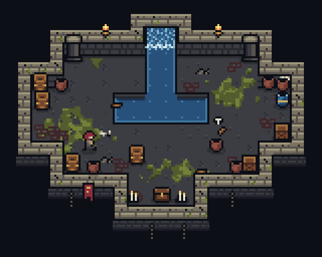

# Diorama study

An original 3/4 top-down dungeon room in the "floating diorama" style: 8-pixel tiles, wall caps with front faces, a sunken pool fed by a waterfall, moss, props, torches and a 7×10 hero who walks in, strikes and breaks a pot. It began as a test of what that style asks of PixelForge ([feasibility report](../../docs/reports/diorama-feasibility-2026-10-07.md)) and now uses the features the test called for.



[Animated GIF](../../docs/images/diorama/room.gif) · [Blue theme](../../docs/images/diorama/room-blue.png) · [By torchlight](../../docs/images/diorama/room-night.png)

## Build and view

```sh
node showcase/diorama/build.mjs --force    # writes art/; --check compares instead
node bin/pixelforge.js preview showcase/diorama/art/room.scene.json
```

`build.mjs` is the authoritative source. It writes `art/`, refusing to overwrite existing files unless you pass `--force`; `npm test` runs `--check`.

## How it is made

- **The room is one recipe.** `room.json` holds the tiles as symbols and draws the map with one `tilemap` operation.
  - Rules give a floor cell its north face when a wall lies above it, and worn bricks (by chance) beside walls.
  - A wall cell gets a plain or cracked cap (weighted autotile templates) and, when nothing lies below it, a cliff offset into the void.
  - The pool is a blob autotile that counts the waterfall as water.
- **Moss uses the composed room.** The operations after the map see it: moss is `dither` with `pattern: "value"` over the floor colour only. Every shadow under a prop is a `shade` ellipse, one step down each colour's ramp, so it is right on stone, floor, moss and brick alike.
- **Water sparkles.** Four frames cycle the water's sparkle keys with frame palettes.
- **One scene for the action.** `room.scene.json` places the room, then:
  - the waterfall, whose left and right halves are chosen by scene rule tiles;
  - torches, foam, chains and the banner;
  - props and the hero sorted by ground line, so the hero walks behind the barrel in the middle of the room;
  - the hero's shadow, a `shade` placement attached to the hero's `feet` point;
  - the smear, attached to the hero's `blade` point and hidden outside the strike;
  - the pot's shards, hidden until the hit.

  All cue times are offsets from one named cue, `strike`.
- **Themes and light.** `room-blue.scene.json` is the same scene with `"palette": "palette-blue.json"` (eight colours changed). `room-night.scene.json` lights it with two torches in `lighting.mode: "ramp"`. Every render keeps exactly the palette's colours.

| File in `art/` | What it is |
| --- | --- |
| `palette.json` | 31 colours and their ramps, linked by every recipe |
| `palette-blue.json` | The blue-stone theme: eight keys recoloured |
| `room.json` | The room: symbols, one tilemap operation, moss, decals, cobwebs and shadows, four sparkle frames |
| `falls.json` | The waterfall's two halves, scrolled with `wrap` |
| `props.json` | Barrels, pots, crates, pillars, chest, candles, torch, foam, banner and chains |
| `hero.json` | Idle, walk down, walk right and a three-pose attack, with `feet` and `blade` points |
| `shadow.json` | The hero's shadow, drawn as a shade placement |
| `slash.json` | The strike's smear |
| `shards.fx.json` → `shards.json` | The pot's debris, a seeded particle burst |
| `room.scene.json`, `room-blue.scene.json`, `room-night.scene.json` | The scene, re-themed and torch-lit |
