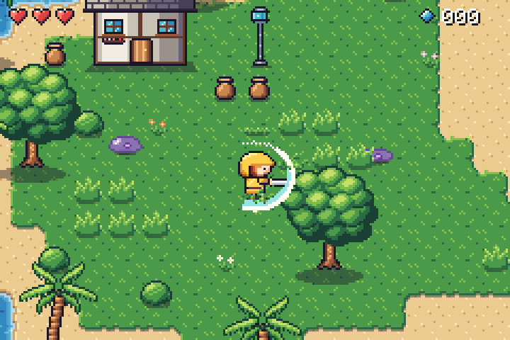
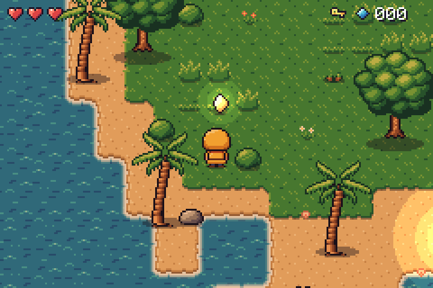

# Tidewatch

An original top-down action-adventure vignette built to see how far an agent can take PixelForge in one sitting. You play a young lighthouse keeper who has to relight the island's lamp before night falls. Every tile, sprite, effect, UI icon and font glyph is a PixelForge recipe; nothing is imported, generated by an image model or loaded from a third party.






## Play

```sh
npm run play:tidewatch
```

Open **http://127.0.0.1:4180**. No install or build step. The loopback-only server serves an allowlist of files from `game/` and has no write endpoints (`TIDEWATCH_PORT` changes the port).

| Action | Keys |
| --- | --- |
| Move | WASD or arrow keys |
| Cutlass (also talks, reads and opens when facing something) | J, Z or Space |
| Talk / open / read | E, X, K or Enter |
| Pause · sound · fullscreen | P or Esc · M · F |

Touch controls appear on narrow and touch screens; the game only scales by whole pixels, so hold a phone in landscape for a larger view. The quest: talk to Old Wren on the pier, find the tower key in the east cove and the sunflint hidden in the tall grass west of the cottage, then open the lighthouse. Dusk falls after the first item; the lamp brings night, the beam and a stats card. Crabs take two hits, brine jellies one; pots and grass drop sea glass and hearts.

## What was made

| Area | Recipes | Frames | Notes |
| --- | --- | --- | --- |
| Terrain | `water`, `terrain/shore.autotile.json` → `shore`, `terrain/grass.autotile.json` → `grass`, `dock` | 12 + 188 + 47 + 6 | Three shimmer variants. Sand and grass are 47-tile blob sets compiled by `pixelforge autotile` from one 32×48 template each; the surf is four palette-cycled variants of the shore set, one animation per mask. |
| Keeper | `poses/keeper.poses.json` → `keeper` | 40 | Pose-compiled: 4 facings × idle/walk/attack, hurt, item-get. Sword arms attach at a shoulder point; blade-tip markers drive the hitbox; foot markers mark contacts. Left-facing poses `mirror` the right-facing ones and the raised right arm is the left arm with `flipX`, so no left-facing part is drawn twice. The origin and markers export as atlas anchors and points. |
| Creatures | `poses/crab.poses.json` → `crab`, `jelly`, `gull`, `fisher` | 11 + 7 + 5 + 4 | Crab claws and eyestalks attach to the shell (the right claw is the left one with `flipX`); the crab's origin is its ground contact and hops lift the body above it; the jelly is deliberately translucent; squash/stretch hop. |
| Scenery | `flora`, `props`, `rocks`, `boat` | 4 + 16 + 2 + 2 | Palm fronds and oak leaf clusters are reusable symbols; one `outline` op traces the oak canopy's silhouette. Every prop carries its ground anchor (per frame where cut or taller variants stand differently). |
| Lit buildings | `lighthouse`, `cottage`, `lamp` (+ `-normal`, `-emissive`) | 5 + 2 + 3 per pass | Hand-authored normal and emissive passes aligned frame for frame. |
| Effects | `effects/fx.fx.json` → `fx`, `slash` | 34 + 12 | `fx` compiles from a `pixelforge-fx` source: leaves flutter, shards bounce and settle, water splashes then rings, and smoke puffs rise and dissolve, all as seeded particle emitters. Hit and sparkle keep their hand-drawn frames, played by one particle. Slash arcs thicken at the blade. |
| Interface | `pickups` (+ emissive), `ui`, `dialog`, `font` | 8 + 8 + 6 + 9 + 76 | 5×7 font with lowercase and an `advance` point per glyph; 9-slice dialog frame. |

That is 29 game recipes (plus 2 pose sources, 2 autotile templates, an effects source and a palette swatch), 527 frames and 122 named animations. Authoritative sources live in `art/`: `art/recipes/*.json`, `art/poses/*.poses.json`, `art/terrain/*.autotile.json`, `art/effects/fx.fx.json` and `art/palette.json`, which every colour recipe links with `"palette": { "$ref": "../palette.json" }` instead of copying it. `keeper`, `crab`, `shore`, `grass` and `fx` are compiled outputs; edit their sources and recompile. The scripts in `tools/make-*.mjs` are the scaffolds that first wrote those sources; they still reproduce them exactly.

## Pipeline

```sh
node bin/pixelforge.js validate showcase/tidewatch/art/recipes/keeper.json
node bin/pixelforge.js inspect showcase/tidewatch/art/recipes/keeper.json --animation walk-r --view onion --native --out walk.png
node bin/pixelforge.js compile showcase/tidewatch/art/poses/keeper.poses.json --out showcase/tidewatch/art/recipes/keeper.json --metadata showcase/tidewatch/art/recipes/keeper.meta.json --force
node bin/pixelforge.js autotile showcase/tidewatch/art/terrain/shore.autotile.json --out showcase/tidewatch/art/recipes/shore.json --force
node bin/pixelforge.js compile showcase/tidewatch/art/effects/fx.fx.json --out showcase/tidewatch/art/recipes/fx.json --force
node bin/pixelforge.js preview showcase/tidewatch/art/scenes/tidewatch-headland-night.scene.json
npm run art:tidewatch      # re-export every atlas, pass and gallery APNG into game/
npm run check:tidewatch    # verify the committed exports still match the recipes
```

`tools/build-assets.mjs` uses PixelForge's own `resolveReferences`, `renderProject`, `buildAtlas`, `encodePNG` and `encodeAPNG`, and copies PixelForge's browser runtime and autotile masks into `game/src/pixelforge/`. Sprite atlases are trimmed (`sheet.trim`), which cut them from 170,496 to 55,874 pixels. The game reads the TexturePacker-style atlases directly: per-frame durations and one-shot animations through the runtime's `frameAt`, sprite placement through each frame's `anchor` with the runtime's `drawFrame` (which restores trimmed frames and flips), the cutlass reach from the strike frames' `hit` points, the held item from the `item` point and glyph widths from `advance` points. Terrain masks come from PixelForge's `neighbourMask`. `tools/make-scene.mjs` turns a 240×160 window of the map into a 10 KB `pixelforge-scene` manifest (file references, three tilemap placements with a ring of context cells, sprites placed by their own frame anchors with `anchor: "frame"`, `lighting.scope: "all"`) for PixelForge's scene viewer; `tools/mosaic.mjs` and `tools/preview-map.mjs` review tiles through the scene renderer.

The browser game (`game/src`) is plain ES modules; its only dependency is PixelForge's own runtime and autotile modules, copied into `game/src/pixelforge/` by the asset build. `world.js` is a deterministic simulation with no DOM access (tested in `test/tidewatch.test.js`). `render.js` draws colour, normal and emissive buffers at 240×160 and composites banded point lights, emission and the lighthouse beam per pixel, so light stays pixel-sharp. `window.__tidewatch.advance(ms)` steps the game deterministically for tests and screenshots.

## Honest assessment

What works: the silhouettes read at 1×, the keeper and crab have distinct authored poses rather than translated stamps, the materials behave differently (surf, leaves, shards, smoke, glass), and the night lighting comes from aligned passes rather than a full-screen tint. What does not yet: the terrain textures repeat at a glance, the oak is symmetrical, the side walk is a small-step chibi cycle, and several props (pebbles, shell) are thin. Details are in [notes/art-review.md](notes/art-review.md). The toolkit gaps and bugs found while building it are in the [findings report](../../docs/reports/tidewatch-showcase-report.md).

## License

Original art and code, MIT licensed with the rest of the repository.
